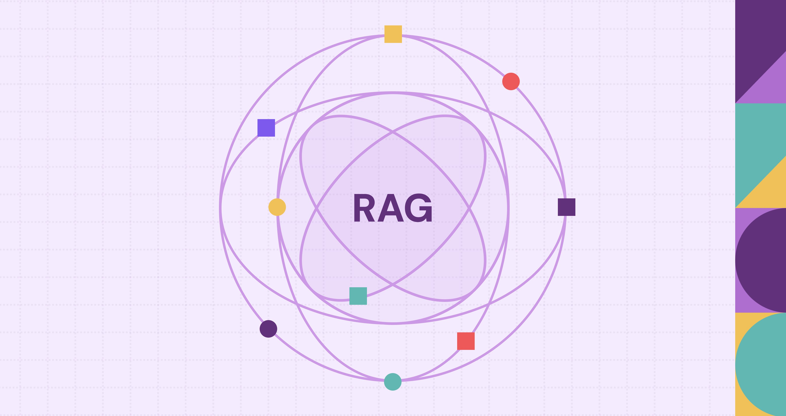

<!-- Typing animation header -->

  

<!-- Sparkle divider -->

  

 

<!-- Contact badges -->

  
  &nbsp;
  
  &nbsp;

 

---

## 🛠️ Languages & Tools

  <!-- Languages -->
  &nbsp;&nbsp;
  &nbsp;&nbsp;

  <!-- Cloud -->
  &nbsp;&nbsp;
  &nbsp;&nbsp;

  
  <!-- Web -->
  &nbsp;&nbsp;
  &nbsp;&nbsp;
  
  <!-- Version Control -->
  &nbsp;&nbsp;
  &nbsp;&nbsp;

  <!-- Databases -->
  &nbsp;&nbsp;

<!-- Custom icons row -->

  &nbsp;&nbsp;
  &nbsp;&nbsp;
  

 

---

## 📊 GitHub Stats

  

 

<!-- Bottom wave -->

  

